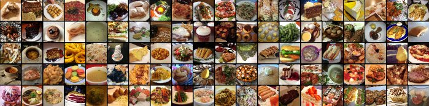

# Assignment 2 Dataset Proposal

**Course:** CO3133 — Deep Learning and Its Applications, Semester 261<br>
**Track:** Image classification<br>
**Dataset:** Food-101, ten-class subset<br>
**Status:** Pending instructor approval

> The [PDF proposal](assignment-2-dataset-proposal.pdf) is the formatted version. This file is the concise review specification; no experimental results are reported.



*Illustrative Food-101 image grid collected from the [official dataset webpage](https://data.vision.ee.ethz.ch/cvl/datasets_extra/food-101/); it is not a measured sample grid.*

## 1. Dataset and task

| Field | Specification |
|---|---|
| Source | [Official ETH Zurich Food-101 page](https://data.vision.ee.ethz.ch/cvl/datasets_extra/food-101/) |
| Version | Official Food-101 release accompanying the 2014 paper |
| Reproducibility ID | Record download URL, archive filename, and SHA-256 checksum before implementation |
| Usage/license | The official page states no separate SPDX-style license. Use is restricted to this course and academic research; images will not be redistributed, and original image rights are retained. |
| Task | Single-label fine-grained food-image classification |
| Input | One RGB image; preprocessing output shape `(3, 224, 224)` |
| Output | One label from the ten selected classes |
| Annotation | One categorical food label per image |
| Loss | Cross-entropy |

Food-101 contains 101 categories and 101,000 images. Each class provides 750 training images and 250 manually reviewed test images. Training images intentionally retain some noise; images have maximum side length 512 pixels. These statistics are from the [official dataset page](https://data.vision.ee.ethz.ch/cvl/datasets_extra/food-101/).

**Citation:**

> Bossard, Lukas, Matthieu Guillaumin, and Luc Van Gool. “Food-101 — Mining Discriminative Components with Random Forests.” *European Conference on Computer Vision*, 2014.

```bibtex
@inproceedings{bossard14,
  title = {Food-101 -- Mining Discriminative Components with Random Forests},
  author = {Bossard, Lukas and Guillaumin, Matthieu and Van Gool, Luc},
  booktitle = {European Conference on Computer Vision},
  year = {2014}
}
```

## 2. Selected subset

Classes are fixed before experimentation as the first ten labels alphabetically.

| ID | Class | Train | Test |
|---:|---|---:|---:|
| 1 | apple pie | 750 | 250 |
| 2 | baby back ribs | 750 | 250 |
| 3 | baklava | 750 | 250 |
| 4 | beef carpaccio | 750 | 250 |
| 5 | beef tartare | 750 | 250 |
| 6 | beet salad | 750 | 250 |
| 7 | beignets | 750 | 250 |
| 8 | bibimbap | 750 | 250 |
| 9 | bread pudding | 750 | 250 |
| 10 | breakfast burrito | 750 | 250 |
| **Total** |  | **7,500** | **2,500** |

The subset satisfies the image-classification thresholds of at least five classes and 5,000 training samples. MNIST and Fashion-MNIST are not used. Results apply only to this ten-class subset.

The ten classes and final splits are fixed before experimentation. A smaller stratified subset may be used only for debugging the data loader, loss, checkpointing, or evaluation code; debugging results are not Assignment 2 results. Record its size, seed, and purpose.

## 3. Distribution analysis and limitations

The selected classes are balanced. Preliminary EDA will report:

- class counts and imbalance;
- image width, height, aspect ratio, and maximum dimension;
- unreadable files and invalid channels;
- exact hashes and perceptual near-duplicates;
- representative images and visually similar class pairs;
- sampled label and image-quality issues.

The dataset may contain label noise and may not represent all cuisines, preparation styles, or deployment conditions. Exact EDA counts will be measured after download.

## 4. Split and leakage prevention

The official test split remains untouched and is reserved for one final evaluation after
model and checkpoint selection. The 7,500 official training images are split at the
image-record level with stratification and seed `42`, producing 6,750 training images
and 750 validation images while preserving class proportions. The fixed seed makes the
manifest deterministic across all configurations:

| Partition | Images | Use |
|---|---:|---|
| Training | 6,750 | Parameter fitting and augmentation |
| Validation | 750 | Model and checkpoint selection |
| Test | 2,500 | One-time final evaluation |

The split unit is the individual image record. The manifest stores path, label, split, and seed. Exact hashes and perceptual duplicate checks are performed before splitting; exclusions are recorded with reasons. Test images are excluded from statistics, hyperparameter selection, early stopping, and checkpoint selection. All runs use the same manifests.

## 5. Preprocessing pipeline

```text
Raw RGB image → validate/resize/augment → DataLoader batch
             → CNN or ResNet-50 → loss and optimizer update
             → prediction and metrics
```

- Convert images to RGB and produce `224 × 224` tensors.
- Training: random resized crop, horizontal flip, and moderate color augmentation.
- Validation/test: deterministic resize and center crop.
- All partitions: ImageNet mean and standard-deviation normalization.
- Validation/test: no gradient updates.

## 6. Models and controlled experiment

**Baseline:** self-implemented CNN with convolutional blocks, normalization, activation, pooling, dropout, and a ten-class linear head; trained from scratch with cross-entropy.

**Pretrained model:** ImageNet-pretrained ResNet-50 with a new ten-class classifier head, following He et al. (2016).

**Fine-tuning procedure:**

1. Freeze the ResNet backbone and train the classifier head.
2. Unfreeze the full network and fine-tune with a lower learning rate for pretrained layers.

**Controlled factor:** frozen backbone versus full fine-tuning. Both configurations use
the same manifests, seed, resolution, augmentation, optimizer family, metrics, and
checkpoint rule. The hypothesis is that full fine-tuning improves macro-F1 at additional
training and inference cost.

| Element | Specification |
|---|---|
| Hypothesis | Full fine-tuning improves macro-F1. |
| Changed factor | Frozen versus fully trainable ResNet-50 backbone |
| Fixed factors | Manifests, seed, resolution, augmentation, optimizer family, evaluation protocol, checkpoint rule |
| Metrics | Accuracy and macro-F1 |
| Decision criterion | Higher validation macro-F1; interpret test metrics with compute cost |
| Configurations | Custom CNN, frozen ResNet-50, full fine-tuning ResNet-50 |

## 7. Evaluation and error analysis

**Primary metrics:** accuracy and macro-F1.<br>
**Secondary measurements:** parameter count, training time, inference latency, and peak memory.

The final report will include correct, difficult-correct, and failed predictions. Error categories will include visual similarity, clutter/occlusion, lighting/framing, presentation variation, and suspected label noise.

For every reported experiment, record hypothesis, changed and fixed factors, metrics, decision criterion, hardware, software versions, seed, checkpoint rule, training time, and inference cost.

## 8. Compute and reproducibility

| Item | Plan |
|---|---|
| Resolution/batch | `224 × 224` RGB; initial batch size 64; GPU with at least 8 GB memory |
| Schedule | CNN: 15 epochs; ResNet-50: 5 head-only plus 10 full-fine-tuning epochs |
| Runs/time | Three main runs; approximately 2–4 GPU-hours total estimate |
| Acceleration | CUDA and mixed precision if available |
| Storage | Approximately 5 GB archive plus subset, manifests, logs, and checkpoints |
| Inference | Warmed-up latency for a fixed batch of 64; record hardware |

Record software versions, hardware, configurations, seeds, manifests, checkpoints, logs, and repository commit/tag for final results. Main implementation begins only after approval or conditional approval.

## References

1. Bossard, Lukas, Matthieu Guillaumin, and Luc Van Gool. “Food-101 — Mining Discriminative Components with Random Forests.” *European Conference on Computer Vision*, 2014.
2. He, Kaiming, Xiangyu Zhang, Shaoqing Ren, and Jian Sun. “Deep Residual Learning for Image Recognition.” *CVPR*, 2016.
